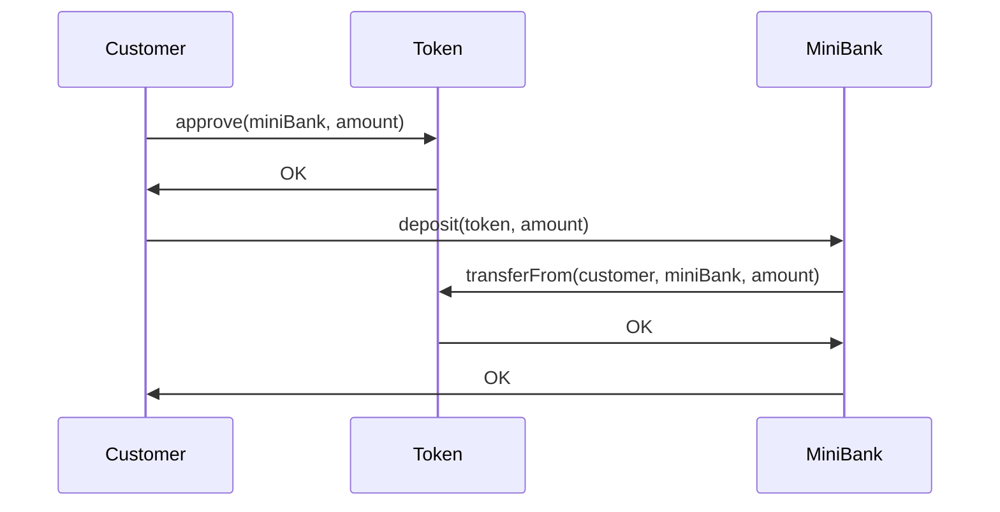
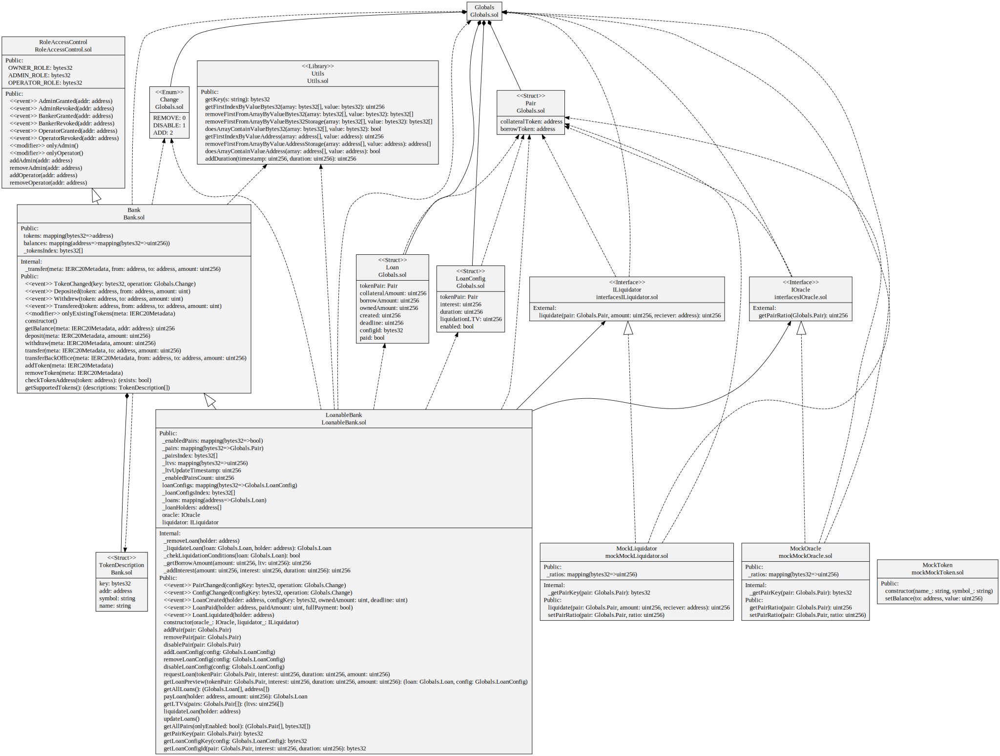

# Mini Bank
The purpose of the implementation is a small **Web3** bank. It is divided into basic custody operations and liquidateable collateralized loans. Custody aspect is enabling customers to make basic operations such as deposits and withdraws. **Collateralized loans** enable customers to take a loan based on provided collateral. Bank supports multiple tokens.

## Roles
The following roles are identified in bank operations:
- **Owner** - the owner of the bank that appoints bank administrators (admins)
- **Admin** - bank administrator who is responsbile for the creation and offering of new bank products (loan offerings in this case) including the appointing of bank operators
- **Operator** - works in Back Office of the bank and is responsbile for making transfers on behalf of customers and executing liquidations of loans
- **Customer** - general stakeholder who uses the bank's offerings

> For the implementation of roles, **RoleAccessControl** based on **AccessControl** contract from **OpenZeppelin** is used.
## Use Cases
Here is the list of roles and respective uses cases which they can execute upon the contract:
|                |Role Type                      |Use Cases                    |
|----------------|-------------------------------|-----------------------------|
|Owner           |Internal                       |`add admin, remove admin`             |
|Admin           |Internal                       |`add/remove token, add/remove operator, add/remove/disable loan pair`|
|Operator        |Internal                       |`liquidate loan, transfer back office, update loans`|
|Customer        |External                       |`transfer, deposit, withdraw, request/pay loan, get balance, see reports`|

## Custody Operations
Account is identified by an address. Address can have a single account. If customer wants multiple accounts, he can use multiple addresses. Custody operations are enabled by introducing deposit/withdraw functions for the customer, as well as management of tokens (currencies) by the administrator. Anybody can do a transfer from its respective account. Operator can do it for anybody from the back office. 

> Anybody can get a list of supported tokens with descriptions by calling **getSupportedTokens()** function.
> Token (currency) is identified through **IERC20Metadata** which is extension of **ERC20** with name, symbol and decimals.
> Deposit is enabled through **approve/transferFrom** pattern requiring 2 transactions, presented in a sequence diagram below.

## Loan Operations
Innovation in Mini Bank is the introduction of collateralized liquidateable loans. Customer can have a single loan. In order to request the loan, he needs to supply a collateral in one of the bank's tokens. Liquidation is enabled when loan breaks deadline or when a collateral value falls below the borrowed amount in accordance to **LTV** (Loan-to-Value).

> Loans are enabled through the concept of **LoanConfigs** which represent an offering of the loan product by the bank

**LTV** (Loan-to-Value) is settable (by admin) per **LoanConfig** based on admin's views on loan. It represents a percentage of loan value in regards to collateral value. 

> If **LTV** value falls betow 100%, loan is over-collateralized. On the contrary, it is under-collateralized or liquidateable
> By calling **updateLoans()** function, operator would liquidate all of the liquidateable loans

## Important Information

- **Mini Bank** is implemented using **Solidity 0.8.9**
- Tests are implemented in **HardHat**
- **Events** are emitted on important operations for external reporting purposes
- **Safe operations** (transfer, transferFrom) are used for proper handling of **bool** return values
- **Oracles** and **Liquidator** are abstracted as interfaces and can be futher implemented/mocked

## Future Improvements

- **Multiple loans** per customer
- Customer can do **staking** with respective **yields**, where those funds would be used for loans (**Compound-like** functionality)
- **Power of Attorney** - customer can add multiple addresses (attorneys) which can do deposits/withdraws on his behalf
- Bank can act as an **escrow** provider, enabling customers the safe transfer of value
- **Mini Bank** represents a governable ERC20 where shareholders can vote on interest rates, new admins/bankers, staking yields etc.
- **ERC20** interface checks on new token introduction for safety/reliability

## Class Diagram

